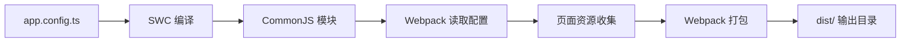

## 产品概述

修复 Taro 3.6.0 微信小程序项目的所有编译问题，确保项目能够成功构建并在微信开发者工具中正常运行。

## 核心功能

- 解决 SWC 编译器与配置文件的兼容性问题
- 清理重复的配置文件，确保项目结构清晰
- 验证项目能够成功编译生成 dist 目录
- 确保所有 5 个页面（home, shop, stats, moments, profile）正确编译
- 验证 tabBar 图标资源正确复制到 dist 目录
- 测试项目在微信开发者工具中的加载

## 技术栈选择

- **Node.js 版本**: v20.11.0 LTS（已安装）
- **框架**: Taro 3.6.0 + React 18
- **编译器**: Webpack 5 + SWC 1.3.66（已降级到兼容版本）
- **样式**: Tailwind CSS 3.0.0
- **目标平台**: 微信小程序

## 技术架构

### 系统架构

采用 Taro 标准编译流程：配置文件 → SWC 转译 → Webpack 打包 → 输出到 dist/

### 问题根因分析

1. **配置文件冲突**: 同时存在 `app.config.ts` 和 `app.config.js`
2. **SWC 配置硬编码**: Taro Helper 将 `syntax: 'typescript'` 硬编码在 SWC 配置中，不区分文件扩展名
3. **编译失败**: 当编译 `.js` 文件时，SWC 尝试用 TypeScript 解析器解析 CommonJS `module.exports` 语法，导致 `Unexpected token '='` 错误

### 解决策略

采用最小修改原则，只保留 TypeScript 版本的配置文件，避免 SWC 语法配置冲突。

## 实现细节

### 核心目录结构

```
stickergotaro/
├── src/
│   ├── app.config.ts          # [KEEP] 唯一的应用配置文件
│   ├── app.tsx               # React 应用入口
│   ├── pages/                # 页面组件
│   ├── assets/               # 静态资源（图标已下载）
│   └── ...
├── config/
│   └── index.js              # [MODIFY] Taro 构建配置
├── dist/                    # [BUILD] 构建输出目录
└── package.json             # [VERIFY] 依赖版本正确
```

### 配置修复步骤

#### 1. 删除冲突的配置文件

- 删除 `src/app.config.js`，只保留 `app.config.ts`
- 删除根目录的 Angular 遗留文件（可选）

#### 2. 验证 app.config.ts 语法

确保使用 TypeScript export default 语法，包含：

- pages: 5 个页面路径
- window: 小程序窗口配置
- tabBar: 底部标签栏配置（含 5 个标签）

#### 3. 清理临时文件

删除构建测试文件：

- build.js, build_direct.js
- test_*.js 文件
- download_icons.js
- create_icons.py

#### 4. 执行完整构建

- 清理 dist 和缓存目录
- 运行 `npm run build:weapp`
- 验证 dist 目录结构

### 构建验证清单

- [ ] dist/project.config.json 存在
- [ ] dist/app.js 存在
- [ ] dist/app.wxss 存在
- [ ] dist/pages/ 包含 5 个页面目录
- [ ] dist/assets/icons/ 包含 10 个图标文件
- [ ] 没有 TypeScript/SWC 编译错误

## 性能与可靠性

- SWC 编译速度：使用 1.3.66 版本，确保稳定性
- 构建缓存：已在 config/index.js 中禁用，避免旧缓存导致的问题
- 依赖管理：使用 `--legacy-peer-deps` 避免 peer dependencies 警告

## 架构设计

### 构建流程



### 目录结构设计

- 源码目录（src/）：保持 Taro 标准结构
- 配置目录（config/）：Taro 构建配置
- 输出目录（dist/）：微信小程序可直接导入

## 关键代码结构（无）

本任务主要是配置和构建修复，不涉及新的代码结构定义。

# Agent Extensions

无需使用任何扩展。